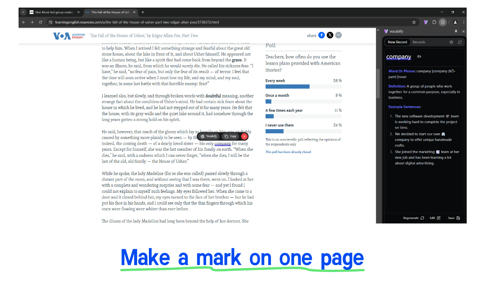
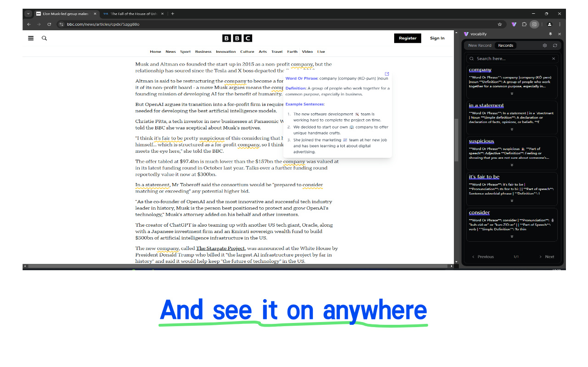
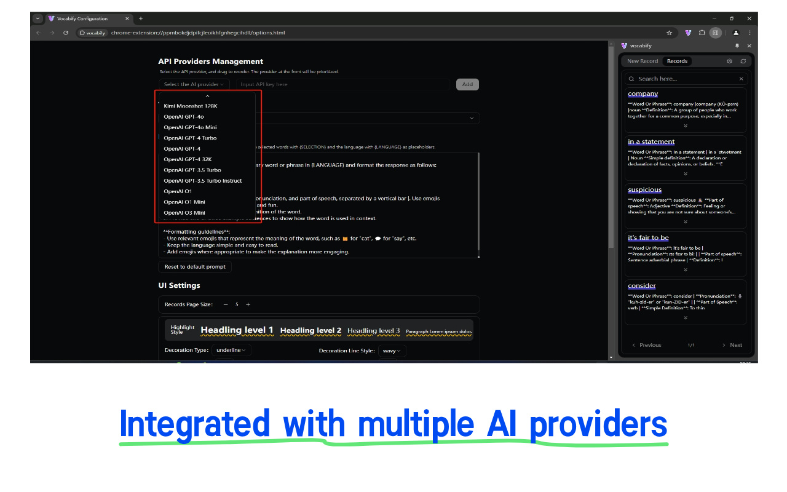
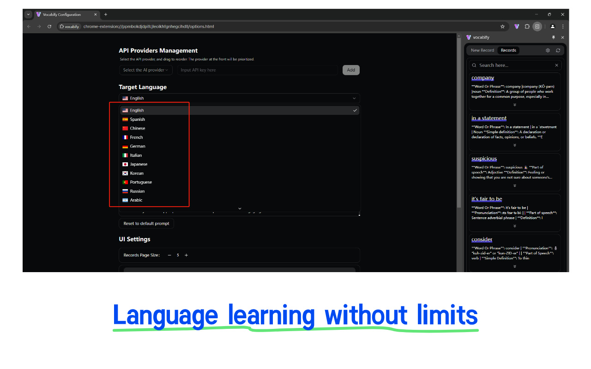
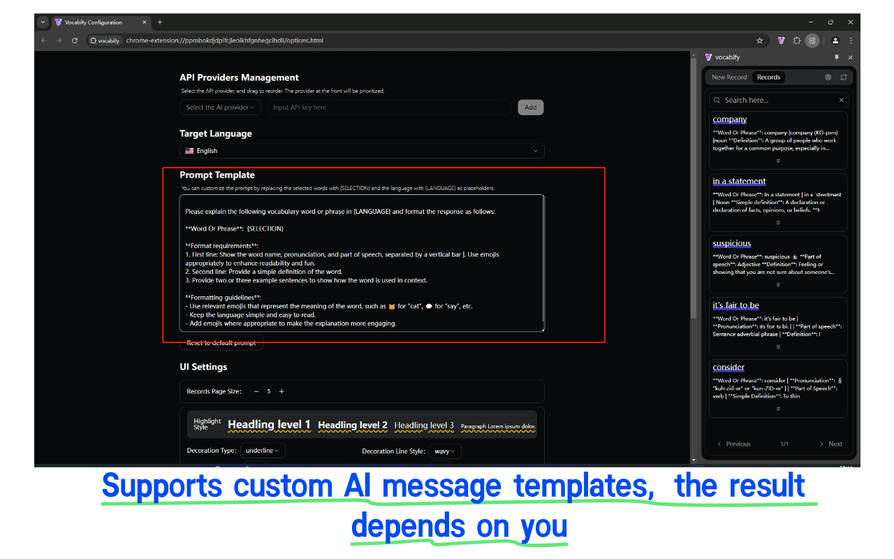
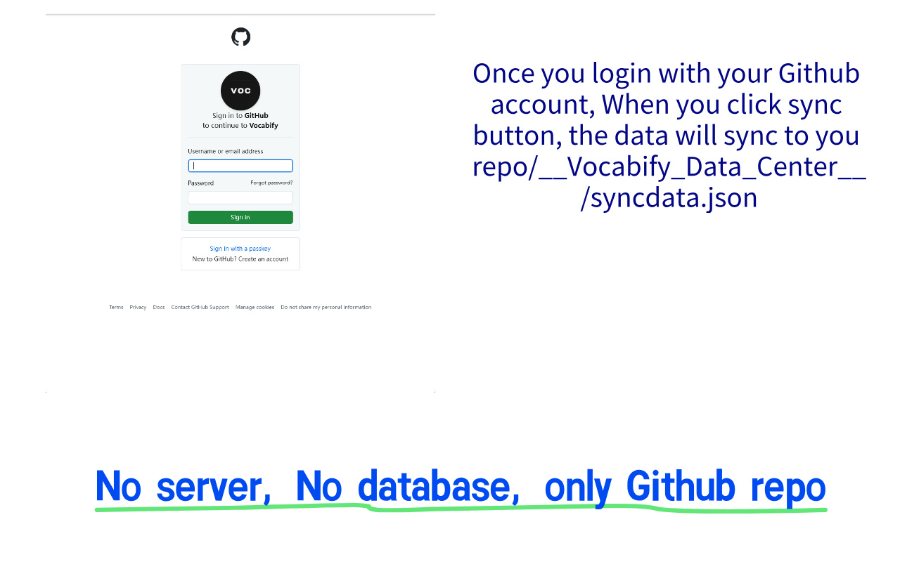

# Vocabify - Your Smart Vocabulary Learning Assistant

<p align="center">
  
</p>
Vocabify is a premium browser extension that helps you learn and manage vocabulary while browsing the web. With AI-powered explanations and smart organization features, it makes vocabulary learning seamless and efficient.

<div style="overflow: hidden;width: 1280px;height: 800px;">
   <div style="height: 100%;display: flex; gap: 1em; overflow-x: scroll;">
     
     
     
     
     
     
   </div>
 </div>

## ✨ Features

### 🎯 Smart Text Selection
- Select any text on a webpage to get instant vocabulary assistance
- Intelligent context detection to avoid invalid selections
- Customizable highlight styles

### 🤖 AI-Powered Explanations
- Multiple AI service providers support (ChatAnywhere, Kimi, XunfeiSpark, OpenAI)
- Customizable explanation templates
- Multi-language support
- Real-time explanation generation

### 📚 Vocabulary Management
- Side panel for easy access to saved vocabulary
- Search and filter capabilities
- Edit and update explanations
- Expandable detailed view
- Pagination support

### ⚙️ Customization Options
- Customizable highlight styles (color, type, thickness)
- Target language selection
- AI API key configuration
- Dark/Light theme support

### 🔄 GitHub Synchronization
- Automatically syncs your vocabulary data with GitHub
- Ensures easy access and backup of your data

### 🔊 Google TTS Integration
- Provides accurate word pronunciations using Google TTS API
- Enhances learning with correct pronunciation support

## Tech Stack

 React,Vite, TypeScript, TailwindCSS, Shadcn UI, LangChain


## 🚀 Installation

1. Clone the repository:
```bash
git clone https://github.com/yourusername/vocabify.git
```

2. Install dependencies:
```bash
pnpm install
```

3. Development mode:
```bash
pnpm dev              # For Chrome
pnpm dev:firefox      # For Firefox
```

4. Build for production:
```bash
pnpm build            # For Chrome
pnpm build:firefox    # For Firefox
```

### Additional Scripts

- **Compile TypeScript**: `npm run compile`
- **Zip for Distribution**: `npm run zip`
- **Post-Install Setup**: `npm run postinstall`

## 🛒 Chrome Web Store

Vocabify is available on the Chrome Web Store for free. 

[](https://chrome.google.com/webstore/detail/vocabify/your-extension-id)


## 🤝 Contributing

We welcome contributions! Please see our [Contributing Guidelines](CONTRIBUTING.md) for details.

1. Fork the repository
2. Create your feature branch (`git checkout -b feature/AmazingFeature`)
3. Commit your changes (`git commit -m 'Add some AmazingFeature'`)
4. Push to the branch (`git push origin feature/AmazingFeature`)
5. Open a Pull Request


## 📝 License

This project is licensed under the MIT License - see the [LICENSE](LICENSE) file for details.

## 🙏 Acknowledgments

- [WXT](https://wxt.dev/) - Browser Extension Framework
- [shadcn/ui](https://ui.shadcn.com/) - UI Components
- [Tailwind CSS](https://tailwindcss.com/) - Styling Framework
- [LangChain](https://github.com/langchain/langchain)
- [OpenAI](https://github.com/openai/openai)
- [Lucide Icons](https://lucide.dev/)

## 📞 Contact

- Project Link: [https://github.com/joisun/Vocabify](https://github.com/joisun/Vocabify)
- Author: joisun
- Email: joi-sun@outlook.com

---

<p align="center">Made with ❤️ for vocabulary learners everywhere</p>