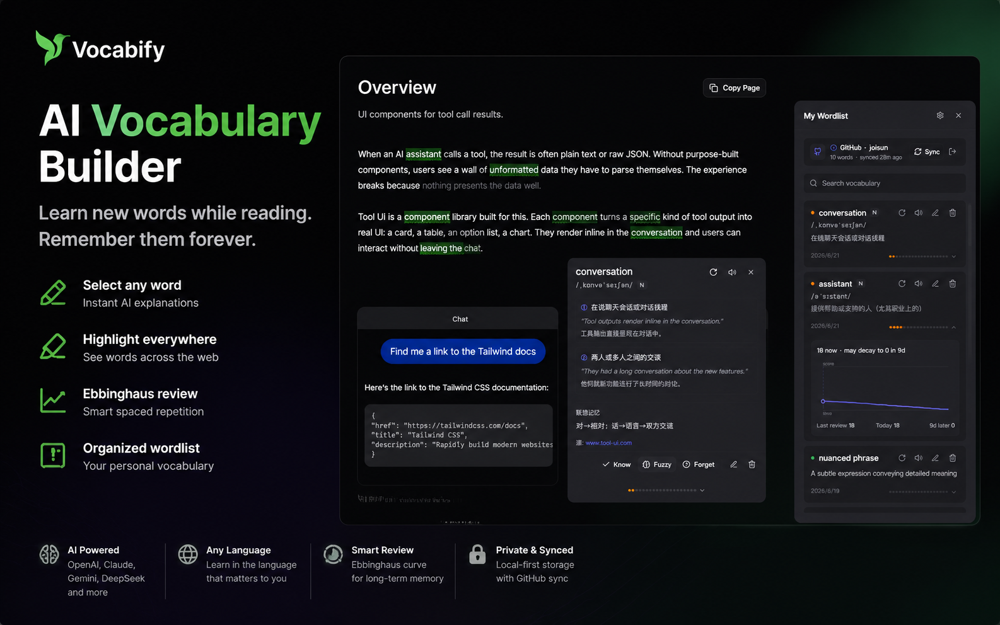

# Vocabify

  

Vocabify is a local-first browser extension for learning vocabulary while you read. Select a word or phrase on any webpage, get a streamed AI explanation, save it to your wordlist, and review it later with a lightweight memory score.

### Usage

https://chromewebstore.google.com/detail/vocabify/jfdeidnhmcefnjohapiemmilcglgpikl

## Features

- **Instant lookup while reading**: select text and open a compact popover without leaving the page.
- **AI-powered explanations**: use OpenAI, Gemini, Anthropic, DeepSeek, GLM, Kimi, or any OpenAI-compatible provider.
- **Streaming vocabulary cards**: definitions, examples, translations, phonetics, and mnemonics render progressively.
- **Saved wordlist**: search, edit, redefine, pronounce, and delete saved entries from the in-page sheet.
- **Memory tracking**: each saved word has a 0-100 familiarity score and a Bézier forgetting forecast.
- **Smart highlights**: saved words are highlighted across webpages with customizable underline/background styles.
- **Local-first storage**: vocabulary lives in extension-origin IndexedDB; GitHub sync is optional.
- **Private sync**: sync to your own private `__Vocabify_Data_Center__` repository through GitHub Device Flow.

## Roadmap

See [plan.md](./plan.md) for the phased product roadmap.

## Privacy

Vocabulary data stays on your device by default. AI requests are sent only to the provider you configure. GitHub sync is opt-in and writes to a private repository under your account. See [privacy-policy.md](./privacy-policy.md).

## Support

If Vocabify helps your reading workflow, you can support the project here:

  

