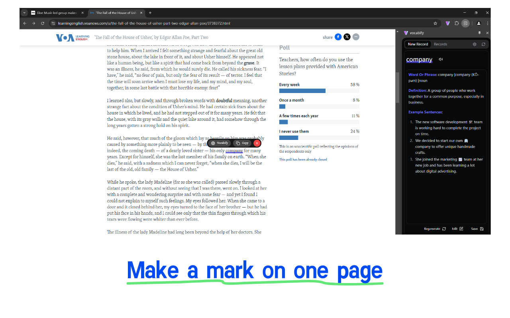
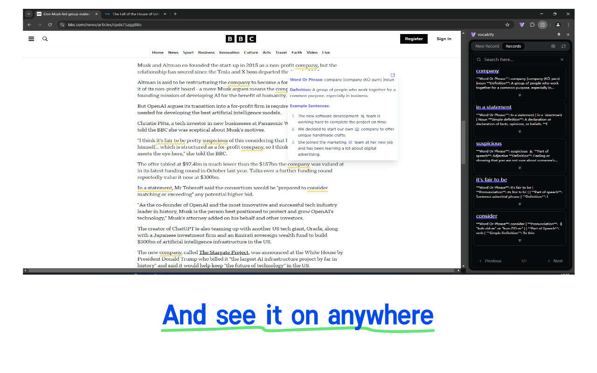
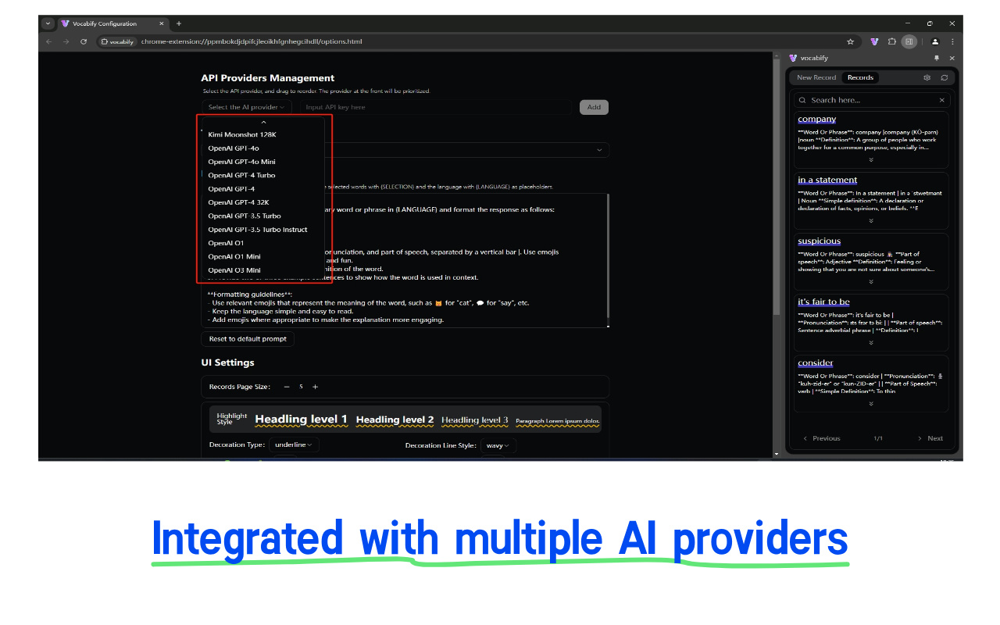
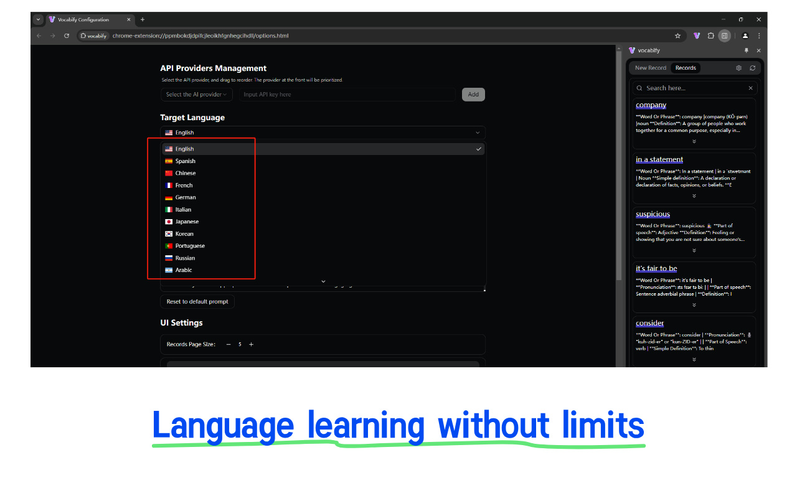
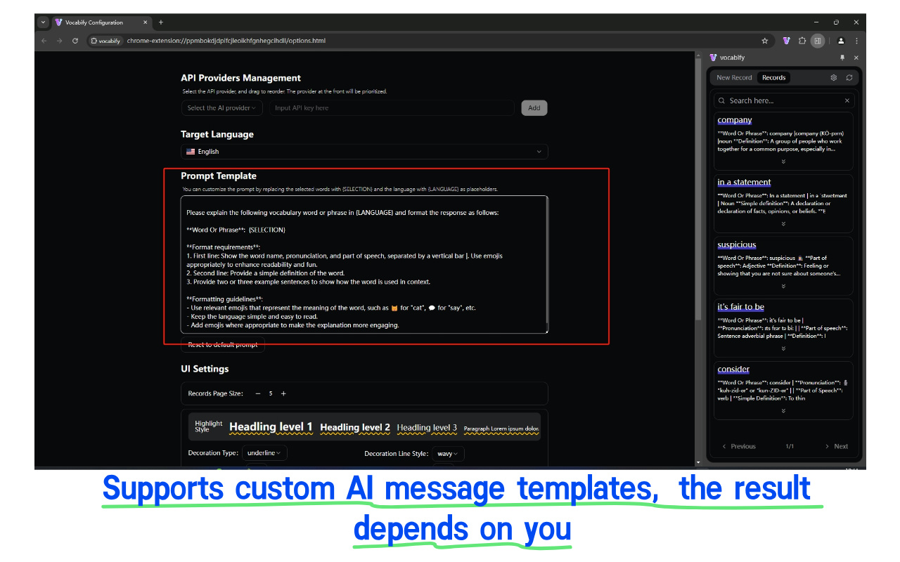
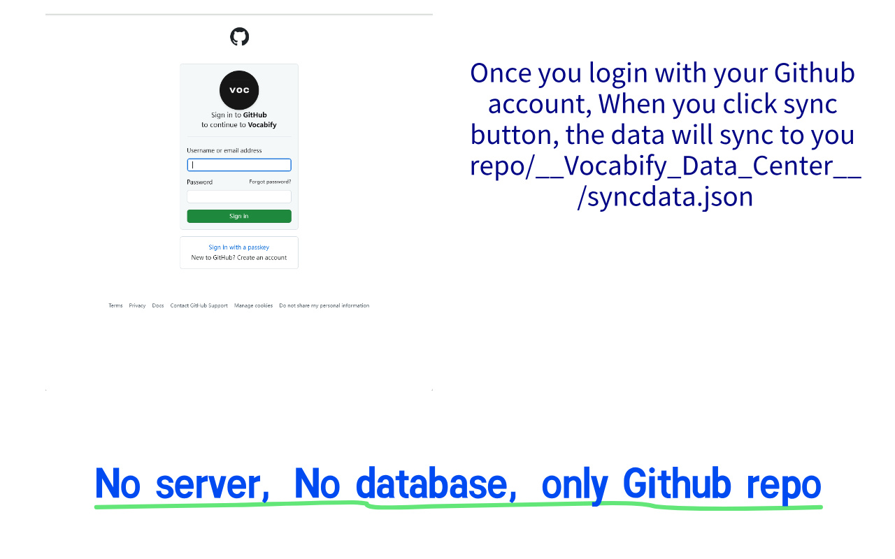

# Vocabify

<p align="center">
  
</p>

A reading-first vocabulary workspace for the browser. Select any word, get a streamed AI explanation, save it, and watch your familiarity score evolve as you re-encounter it across the web.

Built for serious readers, not gamified learners. The interface stays out of the way; the data stays on your machine.

<div style="overflow: hidden;width: 1280px;height: 800px;">
   <div style="height: 100%;display: flex; gap: 1em; overflow-x: scroll;">
     
     
     
     
     
     
   </div>
 </div>

## Highlights

- **Selection-driven flow.** Highlight a word on any page; a compact action popover surfaces explain / save / mark options without breaking your reading position.
- **Streamed AI explanations.** Powered by one active AI provider at a time: popular first-party providers plus OpenAI-compatible GLM / Kimi / custom endpoints.
- **Familiarity scoring.** Every saved word carries a 0–100 score across four tiers — New, Learning, Familiar, Mastered — each with its own highlight color.
- **Lazy spaced decay.** Scores decay over time, but only settle the moment a word is rendered or marked. No background timers, no battery cost.
- **Unified selection popover.** Select a new word → operation bar (查询 / 复制 / 更多). Click 查询 and the popover expands inline with a streaming structured card (phonetic, pos, multiple senses, mnemonic), no side panel detour. Hover a saved word → the same card appears instantly with familiarity marks + inline edit / delete.
- **In-page wordlist.** A side panel for reviewing saved words, opened from the popup or the popover's settings menu.
- **GitHub sync.** Device-Flow OAuth into a private `__Vocabify_Data_Center__` repo. Tombstones travel with the records, so deletions propagate too.
- **Local-first storage.** Dexie-backed IndexedDB; nothing leaves the browser unless you sync it.

## Feature Detail

### Smart text selection
- Select any text to bring up the action popover at the optimal placement (above or below the selection, depending on viewport space).
- Saved words display the current familiarity tier and score directly on the popover with Know (+15) / Fuzzy (+5) / Forget (−10) quick marks.
- Selections inside form fields, contenteditable regions, or extension UI are ignored.

### AI-powered explanations
- First-party providers via Vercel AI SDK: OpenAI, Anthropic, Gemini, and DeepSeek.
- OpenAI-compatible presets and custom providers use provider base URLs. Vercel AI SDK handles the standard `/chat/completions` request path.
- One active provider is used for AI lookup. There is no fallback chain or provider priority ordering.
- Model suggestions load when the provider exposes `/models`; the model can always be typed manually.
- Customizable JSON-only prompt template and target language. The default template instructs the AI to return strict JSON matching the Vocabify schema (`term`, `phonetic`, `pos`, `senses[]`, `mnemonic`).
- Streaming output with timeouts (`totalMs: 60s`, `chunkMs: 30s`) and abort support. A tolerant partial-JSON parser feeds the popover field-by-field as data arrives, while raw JSON and provider reasoning stay hidden from the user-facing card.

### Vocabulary management
- In-page side sheet — Wordlist only (AI lookup lives in the selection popover now).
- Search, edit, expand, and paginate saved entries without leaving the page.
- Records are normalized (trim + lowercase) so duplicates collapse cleanly.

### Familiarity scoring
- Score range: 0–100, mapped to four tiers — New (0) / Learning (1–40) / Familiar (41–70) / Mastered (71–100).
- Marks: Know +15, Fuzzy +5, Forget −10.
- Decay: Learning −10 / 3d, Familiar −10 / 14d, Mastered −5 / 60d. New words never decay until first marked.
- Decay is settled lazily right before each highlight pass and persisted back to IndexedDB.
- Forget resets the decay timer so the next read does not double-deduct.

### Highlighting
- Uses the CSS Custom Highlight API on modern Chromium / Safari and a `<mark>` fallback elsewhere.
- Records are bucketed by tier so the same four-color visual language applies to both rendering paths.
- A debounced `MutationObserver` re-paints after SPA navigations.

### GitHub synchronization
- OAuth Device Flow only — no client secret bundled in the extension.
- Sync target: a private repo named `__Vocabify_Data_Center__`, file `syncdata.json`.
- Payload schema includes records, tombstones, and familiarity fields, so cross-device merges preserve memory state.
- Legacy payloads without familiarity data are backfilled with safe defaults on import.

### Customization
- Highlight color, underline type (wavy / straight / dashed), thickness, offset, and inversion behavior.
- Target language for explanations.
- Single active AI provider, API key, base URL when needed, and model.
- Light / dark theme.

### Pronunciation
- Word pronunciation via Google TTS, surfaced from the editor and record viewer.

## Tech Stack

WXT, React 18, TypeScript, Vite, TailwindCSS, shadcn/ui, Vercel AI SDK, Dexie, Radix UI, Sonner, Lucide.

## Project Structure

```
entrypoints/
  background.ts          # GitHub Device Flow proxy + message routing
  content/               # Selection popover + in-page sheet (Shadow DOM)
  options/               # Provider, prompt, highlight, sync settings
  popup/                 # Browser-action popup
components/              # Sheet (Wordlist-only), VocabList, shadcn/ui primitives
lib/
  aiService.ts           # Vercel AI SDK provider switch + streaming
  aiSchema.ts            # Zod schema for structured AI output (VocabResponse)
  partialJson.ts         # Tolerant incremental JSON parser
  familiarity.ts         # 0-100 score engine, decay rules, mark deltas
  vocabifyDb.ts          # Dexie schema (v5, structured) + tombstone tracking
  highlightService.ts    # Custom Highlight API + <mark> fallback
  githubSync.ts          # Device Flow + syncdata.json read/write
typings/
  aiModelAdaptor.ts      # Provider templates + agent normalization
utils/storage.ts         # WXT storage definitions
```

## Installation

```bash
git clone https://github.com/joisun/Vocabify.git
cd Vocabify
pnpm install
```

## Development

```bash
pnpm dev              # Chrome
pnpm dev:firefox      # Firefox
```

The dev server runs on port `45678` with a persistent Chrome profile under `.wxt/chrome-data` so logins and storage survive reloads.

## Build

```bash
pnpm build            # Chrome
pnpm build:firefox    # Firefox
pnpm zip              # Pack for distribution
pnpm zip:firefox
```

## Other Scripts

- `pnpm compile` — TypeScript type-check, no emit
- `pnpm test:e2e` — Playwright end-to-end tests
- `pnpm postinstall` — `wxt prepare` (runs automatically after install)

## Permissions

Declared in `wxt.config.ts`:

- `storage` — local settings, agents, and sync metadata
- `identity` — used only as part of the GitHub Device Flow proxy
- `host_permissions: ["*://*/*"]` — required so the content script can highlight saved words on any page

## Privacy

All vocabulary data lives in IndexedDB on your device. AI requests go directly from the extension to whichever provider you configured. GitHub sync is opt-in and writes to a private repository under your own account. See [`privacy-policy.md`](./privacy-policy.md) for the full statement.

## Contributing

1. Fork the repository
2. Create a feature branch (`git checkout -b feature/your-feature`)
3. Commit using Conventional Commits (`feat:`, `fix:`, `chore:` ...)
4. Push and open a Pull Request

See [`CHANGELOG.md`](./CHANGELOG.md) for the running history.

## License

MIT — see [`LICENSE`](./LICENSE).

## Acknowledgments

- [WXT](https://wxt.dev/) — browser extension framework
- [Vercel AI SDK](https://sdk.vercel.ai/) — provider abstraction and streaming
- [shadcn/ui](https://ui.shadcn.com/) — component primitives
- [Tailwind CSS](https://tailwindcss.com/) — styling
- [Dexie](https://dexie.org/) — IndexedDB wrapper
- [Lucide](https://lucide.dev/) — icons

## Contact

- Repository: [github.com/joisun/Vocabify](https://github.com/joisun/Vocabify)
- Author: joisun
- Email: joi-sun@outlook.com
